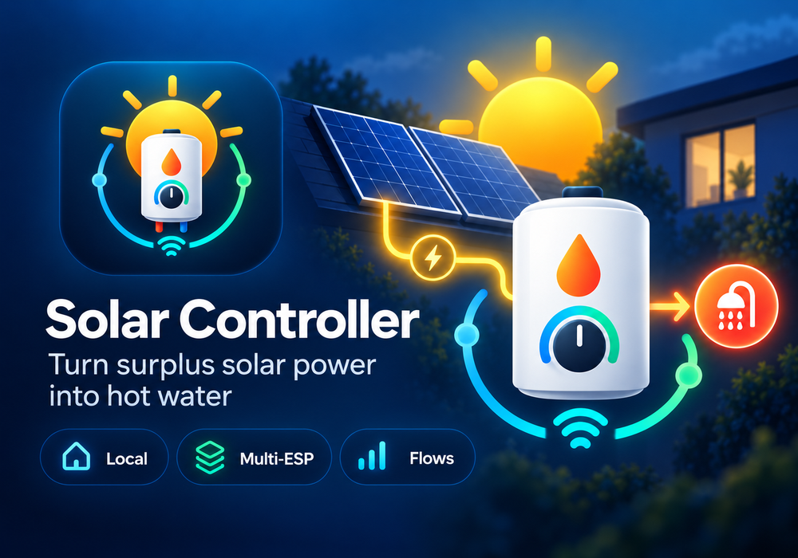

# Solar Controller for Homey

  

Bring your **Solar Controller** into Homey and use your solar surplus more intelligently.

The Homey app connects locally to one or more ESP32-based Solar Controllers and adds live monitoring, control and Homey Flows. The actual solar-surplus regulation continues to run independently on the Solar Controller itself, so the system does not depend on Homey or an internet connection to keep regulating.

## What you can do

- Monitor the current Solar Controller status in Homey.
- View power, PWM output and boiler temperatures.
- Control supported Solar Controller functions from Homey.
- Use triggers, conditions and actions in Homey Flows.
- Add multiple Solar Controllers as separate Homey devices.
- Monitor supported control modes, energy-price information and Multi Controller status.
- Keep communication between Homey and the Solar Controller on your local network.

## Requirements

This Homey app is an extension of the **Solar Controller project** and does not work as a standalone controller.

A complete and working Solar Controller installation is required, including for example:

- An ESP32 running compatible Solar Controller firmware.
- Suitable power-control hardware, such as the **Kemo M240**.
- An electric boiler or heating element controlled by the Solar Controller.
- A configured supported energy/P1 measurement source where required by your Solar Controller setup.
- Homey and the Solar Controller connected to the same local network.
- Homey firmware **7.4.0 or newer**.

For firmware, hardware information, wiring diagrams and installation instructions, visit the main Solar Controller project:

**[Solar Controller firmware & hardware project](https://github.com/glijie/solar-controller-firmware)**

## Adding a Solar Controller to Homey

1. Make sure the Solar Controller is running and reachable on your local network.
2. In Homey, add a new device from the **Solar Controller** app.
3. Enter the IP address or hostname of the Solar Controller.
4. Homey verifies the connection before the device is added.

A DHCP reservation or fixed IP address is recommended for the current manual pairing method.

## Homey Flows

The app provides Flow cards for monitoring and controlling the Solar Controller, including supported functions such as:

- Power and temperature thresholds.
- PWM and output control.
- Force Heat.
- Legionella control.
- Relay control.
- Sun schedule / control mode changes.
- Energy-price updates.
- Multi Controller status and fallback events.

Available Flow cards depend on the capabilities supported by the connected Solar Controller firmware.

## Multiple Solar Controllers

Multiple ESP32 Solar Controllers can be added to the same Homey installation. Each controller appears as its own Homey device and keeps its own settings, measurements and Flow cards.

## Local first

Communication between Homey and the Solar Controller takes place directly over the local network. Homey adds monitoring and automation, while the ESP32 remains responsible for the actual real-time control of the installation.

## Support

Found a problem with the Homey app or have a feature request?

**[Open an issue for the Homey app](https://github.com/glijie/com.patrick.solarcontroller/issues)**

For Solar Controller firmware, hardware or installation questions, use the main project repository:

**[Solar Controller firmware project](https://github.com/glijie/solar-controller-firmware)**

## License

GPL-3.0
